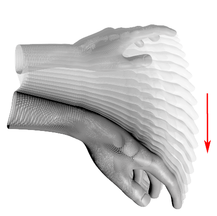

Leap Tetris
====================

Project done for Human Computer Interaction classes @ PUT Poznań [Phd. Wojciech Jaśkowski](http://www.cs.put.poznan.pl/wjaskowski/).

This project was an introduction to Leap Motion SDK. See it in action at http://www.youtube.com/watch?v=-fMHro4C-DQ.

### Running
To launch Leap Tetris you need to have Leap Motion resources available for download [here](https://developer.leapmotion.com/).
```
python TetrisLeap.py
```

### Controls

#### Moving block

To move block you simply have to move your hand in horizontal axis.

#### Rotating block


#### Push block

